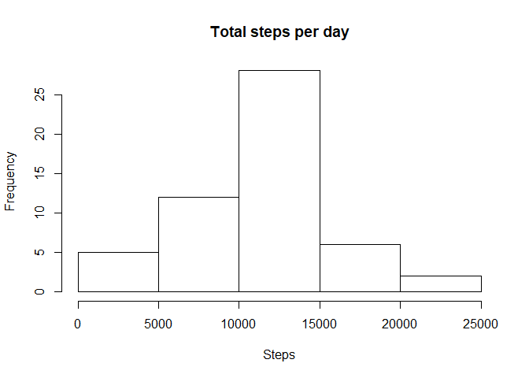
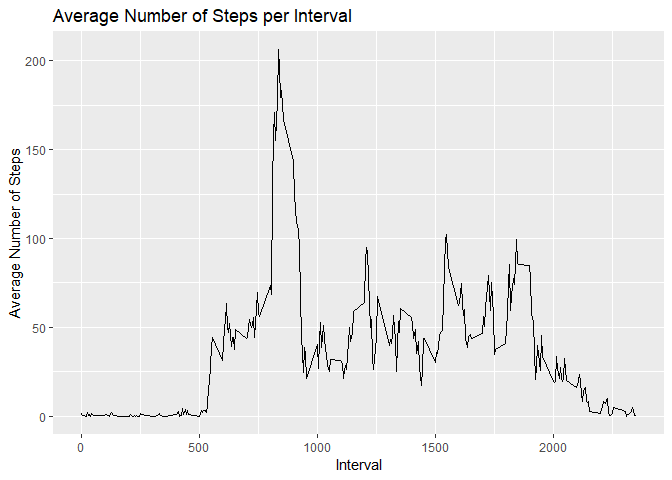
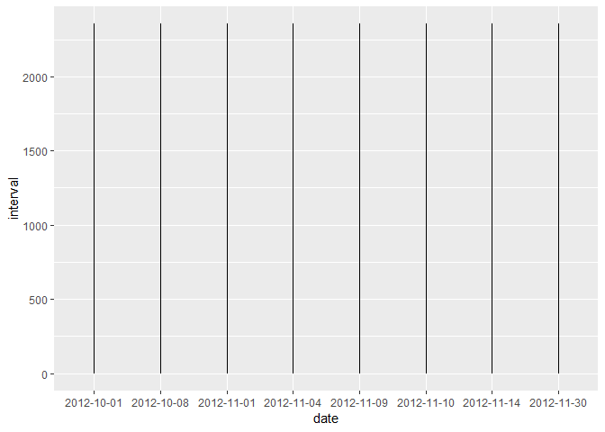
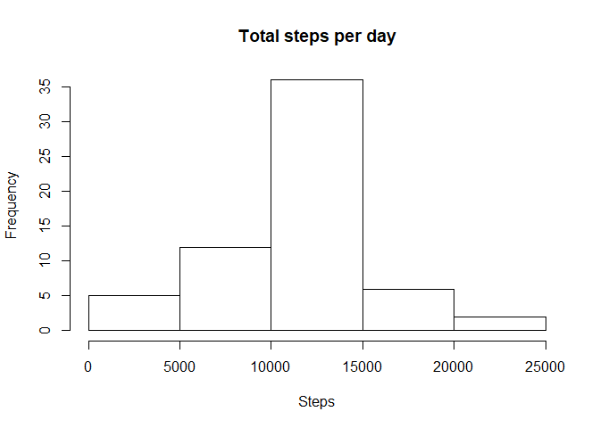
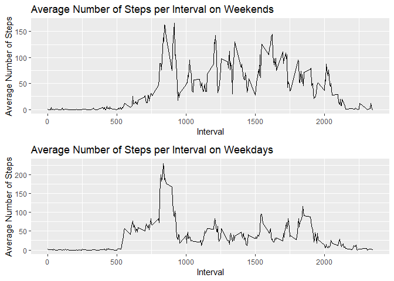

<header>
Reproducible Research: Peer Assessment 1
========================================

</header>
Initialization
--------------

I will begin with all of the packages I intend to use. I have commented
out installation instructions that are implied, but would be useful for
first time users.

    # options(repos = c(CRAN = "https://cran.rstudio.com"))
    # install.packages("plyr") 
    # install.packages("ggplot2")
    # install.packages("HistogramTools")
    # install.packages("rmarkdown")
    # install.packages("gridExtra")
    # library(rmarkdown)
    library(plyr)
    library(ggplot2)
    library(HistogramTools)
    library(gridExtra)

Loading and preprocessing the data
----------------------------------

Set the working directory and initialize the variables necessary to
extract the data for the course.

    setwd("C:/Users/willi/OneDrive/Documents/work-rosetta/Data Science Academy/05 - Reproducible Research/project 1")
    url<-"https://d396qusza40orc.cloudfront.net/repdata%2Fdata%2Factivity.zip"
    str_zip_filename <- "Exercise Data.zip"
    str_input_filename_01<-"activity.csv"

Uncomment and run the following section to download the ZIP file and
extract its contents. This typically only needs to happen once.

    # download.file(url, str_zip_filename, mode = "wb")
    # unzip(str_zip_filename, files = NULL)

This block loads the input file into our R session for use in the
analysis.

    dfdata_raw <- read.csv(str_input_filename_01,stringsAsFactors = FALSE)
    dfdata <- na.omit(dfdata_raw)

What is mean total number of steps taken per day?
-------------------------------------------------

This portion of the code aggregates the total step data at the daily
level and provides a quick histogram for visual reasonability check.

    dailydata<-aggregate(dfdata$steps,by=list(date=dfdata$date),FUN=sum)
    hist(dailydata$x,breaks=5,xlab="Steps",main="Total steps per day")

The mean number of steps per day is:

    median(dailydata$x)

    ## [1] 10765

and the median is:

    mean(dailydata$x)

    ## [1] 10766.19

What is the average daily activity pattern?
-------------------------------------------

Within a given 5 minute interval, the average number of steps taken
across all days contained within the dataset can be seen in the
following histogram:

    intervaldata<-aggregate(dfdata$steps,by=list(interval=dfdata$interval),FUN=mean)
    #head(intervaldata)
    ggplot(intervaldata,aes(x=interval,y=x)) +
            geom_line() + 
            ylab("Average Number of Steps")+
            xlab("Interval")+
            ggtitle("Average Number of Steps per Interval")

The 5 minute interval in which the average number of steps is the
highest is

    intervaldata[intervaldata$x==max(intervaldata$x),1]

    ## [1] 835

and during that interval the user took the following number of steps

    max(intervaldata$x)

    ## [1] 206.1698

Imputing missing values
-----------------------

The following can be used to identify those rows with missing values,
and also to identify how many such rows exist:

    dfdata_na <- dfdata_raw[is.na(dfdata_raw$steps)==TRUE,]
    nrow(dfdata_na)

    ## [1] 2304

To fill these missing values, I will use the average over a given
interval which was computed earlier. To get a better idea of when these
null intervals occur, I will attempt to visualize the missing data by
day and time on the x and y axes of a plot, respectively.

    ggplot(dfdata_na,aes(y=interval,x=date)) +
            geom_line()

    unique(dfdata_na$date)

    ## [1] "2012-10-01" "2012-10-08" "2012-11-01" "2012-11-04" "2012-11-09"
    ## [6] "2012-11-10" "2012-11-14" "2012-11-30"

It appears that there are 8 days which are missing data, so it is
reasonable to fill these missing data rows in with an average value.

The following code labels the given data points as either part of the
originally filled data, or a null data point that will be filled in.

    dfdata_na$isna_ind <- TRUE
    dfdata$isna_ind <- FALSE

This code does the actual filling of the missing values:

    dfdata_na$steps <- intervaldata[dfdata_na$interval==intervaldata$interval,"interval"]

Finally, the filled values can be merged with the original values as
follows:

    na_data_merged<-merge(x = dfdata_na, y=intervaldata, by.x="interval", by.y = "interval")
    na_data_merged$steps<-na_data_merged$x
    na_data_merged<-within(na_data_merged,rm(x))
    na_data_merged<-na_data_merged[,c("steps","date","interval","isna_ind")]

    filled_data<-rbind(na_data_merged,dfdata)
    filleddailydata<-aggregate(filled_data$steps,by=list(date=filled_data$date),FUN=sum)

For a visual representation of the data, reference the following
histogram and compare it to the previous version which excluded NAs:

    #4
    hist(filleddailydata$x,breaks=5,xlab="Steps",main="Total steps per day")

The new mean and median daily step values have changed slightly after
the filling and are:

    median(filleddailydata$x)

    ## [1] 10766.19

    mean(filleddailydata$x)

    ## [1] 10766.19

Are there differences in activity patterns between weekdays and weekends?
-------------------------------------------------------------------------

To answer the question, first we will reformat the date column in a more
useful format and then add a new column containing the name of the day
of the week:

    filled_data$date<-as.Date(as.character(filled_data$date),format ="%Y-%m-%d")
    filled_data$dayname<-weekdays(filled_data$date)

Next we will add a new column to the dataset indicating whether each row
is part of the weekend or a weekday:

    weekdays<-c("Monday","Friday","Wednesday","Thursday","Tuesday")
    filled_data$weekend_ind<-filled_data$dayname %in% weekdays
    filled_data$weekend_factor<- factor(filled_data$weekend_ind)
    filled_data$weekend_factor<-revalue(filled_data$weekend_factor,c("TRUE" = "Weekday", "FALSE"="Weekend"))

With the data factored on weekday vs weekend, we will split it into two
data sets for convenience and average each at the daily level:

    weekdaydata<-filled_data[filled_data$weekend_factor=="Weekday",]
    weekenddata<-filled_data[filled_data$weekend_factor=="Weekend",]
    weekdayintervaldata<-aggregate(weekdaydata$steps,by=list(interval=weekdaydata$interval),FUN=mean)
    weekendintervaldata<-aggregate(weekenddata$steps,by=list(interval=weekenddata$interval),FUN=mean)

Finally, we will create two graphs using GGPLOT2 and then display both:

    p1<-ggplot(weekendintervaldata,aes(x=interval,y=x)) +
            geom_line() + 
            ylab("Average Number of Steps")+
            xlab("Interval")+
            ggtitle("Average Number of Steps per Interval on Weekends")

    p2<-ggplot(weekdayintervaldata,aes(x=interval,y=x)) +
            geom_line() + 
            ylab("Average Number of Steps")+
            xlab("Interval")+
            ggtitle("Average Number of Steps per Interval on Weekdays")

    grid.arrange(p1,p2,nrow=2)

In short, there is a noticeable difference between activity during the
week and over the weekend.
